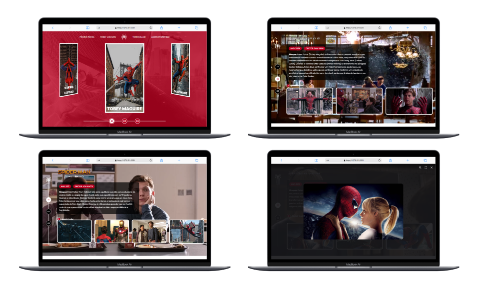

# ⚡ Projeto: Landing Page

## 🚀 Bem-vindo ao projeto **Landing Page do Homem-Aranha**!
#### Este projeto foi desenvolvido em:

1. HTML5
2. CSS3
3. JavaScript

## Pré-requisitos
Antes de rodar o projeto, é necessário ter a extensão **Live Server** instalada no **Visual Studio Code**.

### Como rodar o projeto:
1. Instale a extensão **Live Server** no Visual Studio Code.
2. Clique com o botão direito do mouse no arquivo `index.html`.
3. Escolha a opção **Open with Live Server** para subir a aplicação no localhost.
4. Pronto! A landing page do Homem-Aranha estará pronta para ser acessada localmente.

## Visual do Projeto

### Tecnologias Utilizadas:
- **HTML5** para a estrutura da página.
- **CSS3** para estilização, incluindo transições e responsividade.
- **JavaScript** para interatividade e efeitos dinâmicos na página.

---
Desenvolvido com ❤️ dedicação e criatividade.
